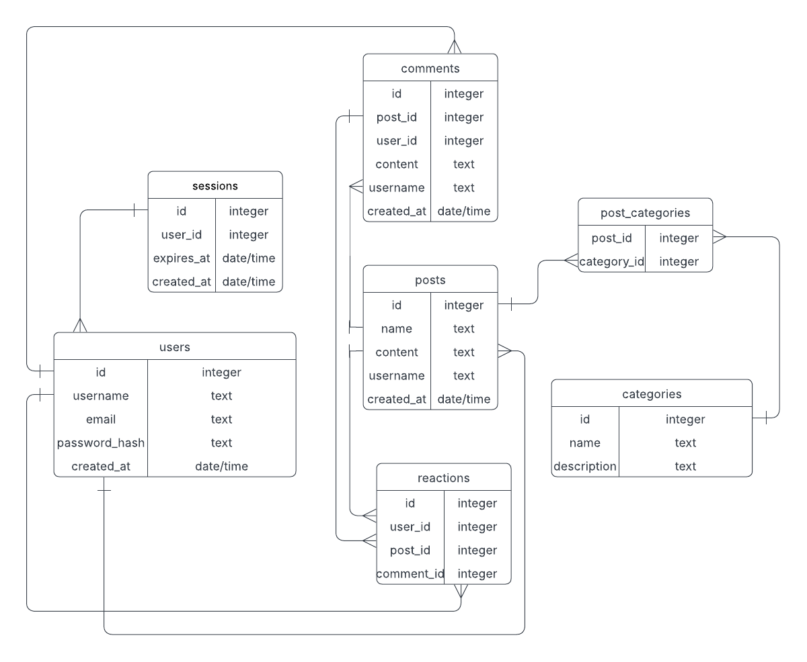

# Forum Application

## Description
This is a simple forum application where users can:
- Create and post questions
- Comment on other users' posts
- Like and dislike posts and comments
- Choose categories when creating posts
- Filter posts to view only their own or the ones they have liked

The application uses an **SQL database** for storing user data, posts, comments, and reactions.

## Features
- User authentication
- Post creation with category selection
- Commenting on posts
- Like and dislike functionality for both posts and comments
- Filtering options to view:
  - Own posts
  - Liked posts and comments

## Technologies Used
- **Golang** for backend logic
- **HTML, CSS, JavaScript** for frontend
- **SQL Database** for data storage
- **Docker** for easier deployment

### Running with Docker

1. **Give user rights to the shell script**:
   ```bash
   chmod +x docker.sh
2. **Run the Docker container:**
3. **Access the forum:**
Once the container is up, open it in Docker and visit the forum in your browser.

## Running with GO 
1. Clone the repository:
   ```sh
   git clone https://01.gritlab.ax/git/kovsiien/forum.git
   cd forum
   ```
2. Install dependencies (if needed).
3. Set up the database.
4. Run the application:
   ```sh
   go run .
   ```
5. Open the application in your browser on http://localhost:8080

### ER Diagram



## Authors
- **Maris**
- **Sergei**
- **Kateryna**

## License
This project is for educational purposes and does not have a specific license yet.